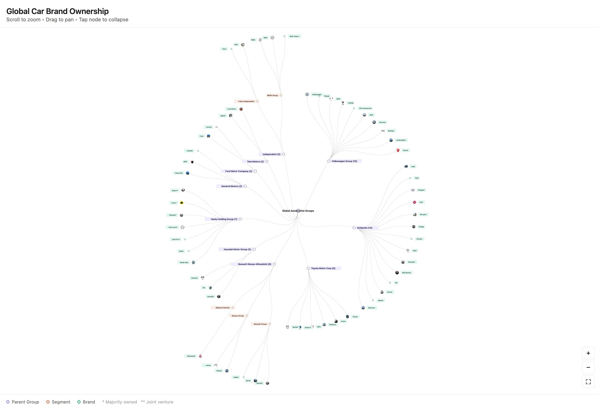

# Car Ownership Tree

An interactive radial tree chart showing global automotive brand ownership — which parent corporations control which car brands.



## Features

- **Radial tree layout** — root in the center, brands radiate outward
- **Click to collapse/expand** any node to reduce clutter
- **Level controls** — collapse all parent groups or segment nodes at once
- **Group country flags** — top-level groups show headquarters or primary-country flags
- **Scroll to zoom, drag to pan** around the chart
- **Brand logo images** displayed for each leaf node
- **Dark mode** support (follows OS preference)
- **Asterisk notation**: `*` = majority-owned, `**` = joint venture

## Data

Covers 22 major automotive groups and ~104 brands:

| Group | Brands |
|-------|--------|
| Volkswagen Group | VW, Škoda, SEAT, CUPRA, Audi, Porsche, Bentley, Lamborghini, Ducati |
| Stellantis | Jeep, Ram, Peugeot, FIAT, Chrysler, Dodge, Citroën, Opel, Vauxhall, Alfa Romeo, DS, Lancia, Abarth, Maserati |
| Toyota | Toyota, Lexus, Daihatsu, Hino, Subaru\*, Mazda\* |
| Renault-Nissan-Mitsubishi | Renault, Dacia, Alpine, Nissan, Infiniti, Mitsubishi |
| Hyundai | Hyundai, Kia, Genesis |
| Mercedes-Benz Group | Mercedes-Benz, Mercedes-AMG, Mercedes-Maybach |
| Honda | Honda, Acura |
| Suzuki | Suzuki, Maruti Suzuki\* |
| Geely | Geely Auto, Zeekr, Lynk & Co, Volvo\*, Polestar\*, Lotus\*, Smart\*\* |
| SAIC Motor | MG, Roewe, IM Motors, Maxus/LDV, Wuling\*\*, Baojun\*\* |
| Chery Holding Group | Chery, Exeed, Jetour, iCAR, Omoda, Jaecoo, Luxeed\*\* |
| Great Wall Motor | Haval, Wey, Tank, Ora, Poer |
| Changan Automobile | Changan, Deepal, Avatr\*\* |
| FAW Group | Hongqi, Bestune, Jiefang |
| Dongfeng Motor | Dongfeng, Voyah, M-Hero |
| BAIC Group | BAIC, Beijing, Arcfox |
| General Motors | Chevrolet, GMC, Cadillac |
| Ford | Ford, Lincoln |
| Tata Motors | Jaguar, Land Rover |
| Mahindra Group | Mahindra, Pininfarina |
| BMW Group | BMW, MINI, Rolls-Royce |
| Independent | Tesla, BYD, Ferrari, Aston Martin, McLaren, Lucid, Rivian, VinFast, Isuzu |

## Logo download

```bash
python3 download-logos.py
```

Downloads brand logos from Wikipedia to `car-logos/`. Run once — it handles retries and fallbacks automatically.

## Disclaimer

**Data accuracy**: The ownership structure shown reflects publicly available information as of **June 2026**. Corporate ownership can change — always verify against official sources before relying on this data.

**No liability**: This project is provided for informational purposes only. The authors make no representations or warranties of any kind, express or implied, about the completeness, accuracy, or reliability of the information. You use it at your own risk.

## License

[MIT](LICENSE) © Namuan
